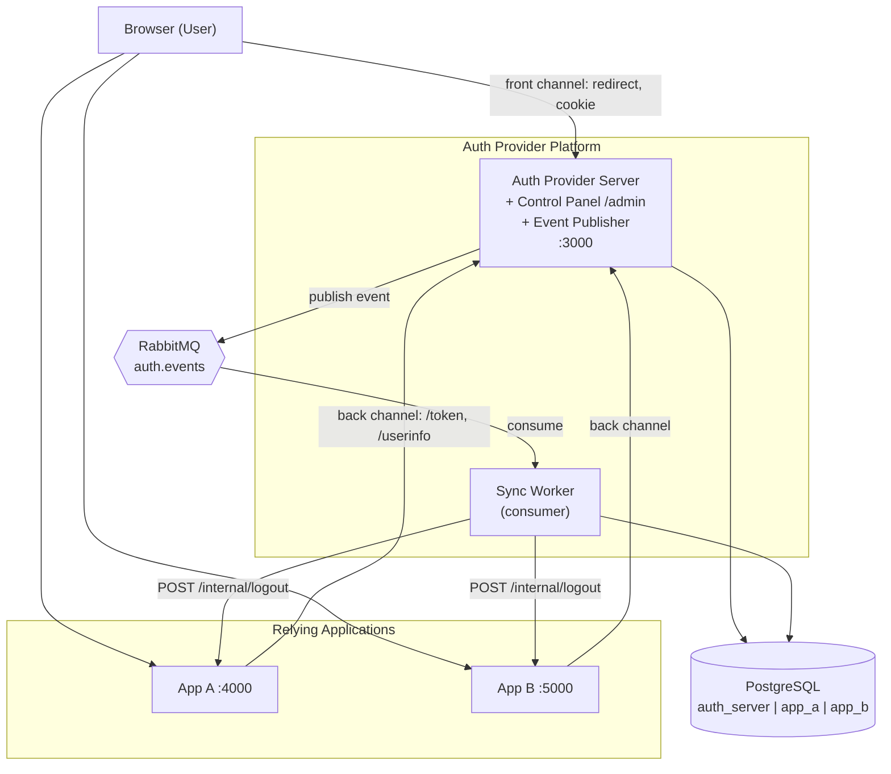
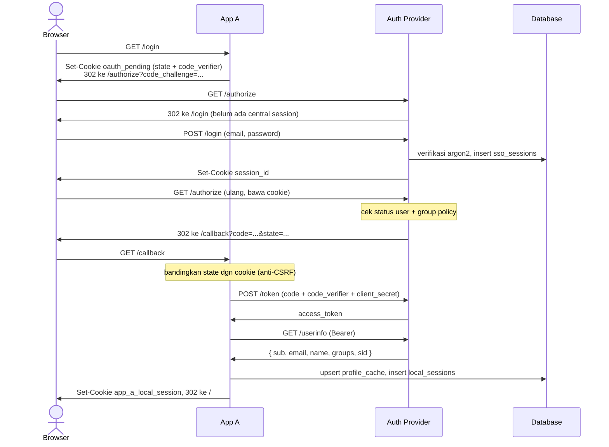

# Identity & Authorization Provider

Sistem Single Sign-On terpusat: satu kali login di Auth Provider, dua aplikasi (App A & App B) bisa dibuka tanpa login ulang, dan pencabutan akses disebarkan ke seluruh aplikasi secara asinkron lewat message queue.

## Identitas

| | |
|---|---|
| **Nama** | _Manuel Thimoty Silalahi_ |
| **NIM** | _13524102_ |

---

## Cara Menjalankan Sistem

### Prasyarat

- **Docker Desktop** (dengan Docker Compose v2) dalam keadaan **berjalan**
- Port kosong: `3000`, `4000`, `5000`, `5432`, `5672`, `15672`. Kalau bentrok, ubah nilainya di `.env`
- Node.js 22 hanya diperlukan bila ingin menjalankan service tanpa Docker

### Langkah

```bash
# 1. siapkan environment
cp .env.example .env        # PowerShell: Copy-Item .env.example .env

# 2. nyalakan seluruh sistem
docker compose up -d --build

# 3. tunggu sampai semua service healthy
docker compose ps
```

**Hanya itu.** Migration dan seed **berjalan otomatis**, tidak ada perintah manual tambahan.

### Migration & Seed

Keduanya sudah menjadi bagian dari `CMD` container, bukan langkah terpisah:

| Service | Perintah saat start |
|---|---|
| `server` | `node dist/db/migrate.js && node dist/db/seed.js && node dist/index.js` |
| `app-a` / `app-b` | `node dist/db/migrate.js && node dist/index.js` |

Kalau migration atau seed gagal, container berhenti dengan exit code non-zero. Hal ini dilakukan dengan sengaja, supaya kegagalan terlihat jelas alih-alih server menyala setengah jalan dengan tabel yang belum ada. Seed bersifat idempotent (pola *get-or-create*), jadi aman dijalankan berulang kali saat container restart.

Verifikasi lewat log:

```bash
docker compose logs server --tail 10
# Start migration
# Migrations complete.
# Start DB Seeding
# Seed complete.
# Auth listening on port 3000
```

### URL tiap komponen

| Komponen | URL | Keterangan |
|---|---|---|
| Auth Provider Server | http://localhost:3000 | Login, OAuth, token, userinfo |
| Control Panel Admin | http://localhost:3000/admin | UI admin (login sebagai admin) |
| App A | http://localhost:4000 | Relying Application A |
| App B | http://localhost:5000 | Relying Application B |
| RabbitMQ Management | http://localhost:15672 | Login `guest` / `guest` |
| PostgreSQL | `localhost:5432` | 3 database: `auth_server`, `app_a`, `app_b` |
| Sync Worker | — | Tanpa port ke host; pantau via `docker compose logs sync-worker` |

### Akun hasil seed

| Email | Password | Role | Status | Group |
|---|---|---|---|---|
| `admin@example.com` | `Admin123!` | admin | active | admins |
| `user1@example.com` | `Password123!` | user | active | users |
| `user2@example.com` | `Password123!` | user | active | users |
| `user3@example.com` | `Password123!` | user | **inactive** | users |

Dua aplikasi ikut ter-seed: `app-a` (secret `app-a-secret`) dan `app-b` (secret `app-b-secret`), keduanya mengizinkan group `admins` dan `users`.

### Perintah operasional

```bash
docker compose logs sync-worker -f              # pantau satu service
docker compose stop app-a                       # matikan satu service (uji resilience)
docker compose exec postgres psql -U postgres -d auth_server
docker compose up -d --build server             # rebuild setelah ubah kode
docker compose down                             # stop, data tetap ada
docker compose down -v                          # reset total (buang volume)
```

> Setelah mengubah kode TypeScript, `--build` **wajib** — kode dikompilasi ke dalam image saat build, bukan di-mount dari host.

---

## Arsitektur & Alur

### Komponen



Setiap komponen berjalan sebagai container terpisah dengan Dockerfile masing-masing, kecuali **Control Panel** dan **Event Publisher** yang menyatu dalam proses Auth Provider Server (keduanya hanya butuh database yang sama dan tidak menyimpan state sendiri).

Diagram ER lengkap (semua tabel di ketiga database): **https://dbdiagram.io/d/6a80bca0c6a866c907745bb0**

### Dua tingkat session

Ini fondasi seluruh sistem:

| | Central Session | Local Session |
|---|---|---|
| Pemilik | Auth Provider | App A / App B masing-masing |
| Disimpan di | `auth_server.sso_sessions` + cookie `session_id` | `app_a`/`app_b`.`local_sessions` + cookie `app_a_local_session` / `app_b_local_session` |
| Jangkauan | Lintas semua aplikasi (inilah yang membuat SSO terasa "sekali login") | Hanya aplikasi itu sendiri |

Access token **tidak** dipakai sebagai session aplikasi. Token hanya dipakai sekali di back channel untuk mengambil identitas (`/userinfo`), lalu dibuang; setelah itu aplikasi berdiri di atas local session-nya sendiri.

> **Catatan cookie:** nama cookie sengaja diberi prefix per aplikasi. Browser tidak memisahkan cookie berdasarkan port  , sehingga `localhost:4000` dan `localhost:5000` berbagi satu ruang cookie yang sama. Tanpa nama berbeda, cookie App B akan menimpa milik App A dan logout di satu aplikasi ikut menghapus cookie aplikasi lain.

### Alur login (OAuth 2.0 Authorization Code + PKCE)



`code_verifier` tidak pernah melewati browser, yang lewat hanya `code_challenge` (hash-nya). Penyerang yang mencuri authorization code tetap tidak bisa menukarnya menjadi token.

### Alur pencabutan akses (asinkron, transactional outbox)

```
Aksi (SSO logout / ganti password / deactivate user / ubah policy)
  └─ SATU transaksi: cabut session + INSERT ke tabel `events`  ← outbox
       └─ Event Publisher (loop 2 detik) → publish ke exchange auth.events
            └─ Sync Worker consume
                 ├─ tentukan aplikasi tujuan (applications.logout_notification_url)
                 ├─ catat status per aplikasi di `event_deliveries`
                 └─ POST /internal/logout ke tiap aplikasi
                      ├─ sukses          → ack
                      ├─ gagal sementara → retry queue (TTL 30 detik), maks 5 percobaan
                      └─ retry habis     → Dead-Letter Queue
```

Kunci pola **transactional outbox**: pencabutan session dan pencatatan event terjadi dalam transaksi database yang **sama**. Kalau dipisah, ada celah di mana session sudah dicabut tetapi proses mati sebelum event tercatat , atau dengan kata lain aplikasi tidak akan pernah diberi tahu dan local session-nya hidup terus. Konsekuensinya, RabbitMQ yang sedang mati tidak membuat event hilang: event menunggu di tabel `events` dan menyusul begitu broker menyala.

Tiga jenis event:

| Event | Kapan | Cakupan pencabutan |
|---|---|---|
| `SessionRevoked` | SSO logout, atau user dinonaktifkan admin | Satu central session tertentu (`central_session_id`) |
| `PasswordChanged` | Password user diubah | **Semua** session milik user itu |
| `AccessPolicyChanged` | Perubahan policy membuat user kehilangan akses | Hanya aplikasi yang bersangkutan (`application_id`) |

Format payload minimum:

```json
{
  "eventId": "uuid",
  "eventType": "SessionRevoked",
  "userId": "uuid",
  "centralSessionId": "uuid",
  "applicationId": null,
  "reason": "sso_logout",
  "occurredAt": "2026-07-28T10:00:00Z",
  "metadata": {}
}
```

---

## Keputusan Teknis

### 1. Opaque token, bukan JWT

Access token, authorization code, dan session token semuanya berupa **string acak 32 byte (opaque)** yang divalidasi dengan lookup ke database.

**Alasan:** requirement utama sistem ini adalah **pencabutan akses yang cepat** (SSO logout, ganti password, perubahan policy). Perhatikan juga bahwa JWT bersifat *self-contained* yuang artinya server memvalidasinya dari tanda tangan tanpa menyentuh database, sehingga token yang sudah "dicabut" tetap dianggap sah sampai kedaluwarsa. Untuk menutup celah itu dengan JWT tetap dibutuhkan daftar pencabutan yang dicek tiap request. Hal ini  berarti tetap query database, hilang sudah keunggulan utamanya.

**Konsekuensi yang diterima:**

| Konsekuensi | Catatan |
|---|---|
| Setiap validasi token butuh query database | Diterima; `/userinfo` hanya dipanggil sekali per login, bukan tiap request halaman |
| Auth Provider jadi titik pusat yang harus tersedia | Diredam dengan `profile_cache` di sisi aplikasi, sehingga halaman aplikasi tetap render tanpa memanggil Auth Provider |
| Tidak bisa divalidasi offline oleh pihak ketiga | Smua konsumen token adalah aplikasi internal |
| **Untungnya:** pencabutan berlaku seketika | Cukup ubah satu baris `status` di database |

Yang disimpan di database selalu **hash SHA-256**-nya; nilai mentah hanya ada di cookie/response. Password dan client secret memakai **argon2id** (algoritma *memory-hard*, dirancang untuk melawan serangan paralel).

### 2. Message broker: RabbitMQ

**Alasan:** semantik yang dibutuhkan di sini adalah *antrian pekerjaan*  (tiap event diproses satu kali oleh satu worker) , dengan retry dan dead-letter bila gagal. Dari fakta tersebut, sayua mengganggkat fakta bahwa RabbitMQ lebih cocok. Kafka lebih tepat untuk *event streaming* dengan replay dan retensi log, yang tidak dibutuhkan. Selain itu, Kafka tidak punya konsep dead-letter atau per-message TTL secara native, keduanya harus dibangun sendiri di sisi konsumer.

Topologi yang dipakai:

| Objek | Tipe | Fungsi |
|---|---|---|
| `auth.events` | topic exchange | Tujuan publish, routing key `event.<EventType>` |
| `sync-worker.events` | queue | Antrian utama, binding `event.*` |
| `auth.events.retry` → `sync-worker.events.retry` | exchange + queue | TTL 30 detik, lalu dead-letter kembali ke antrian utama |
| `auth.events.dlq` → `sync-worker.events.dlq` | exchange + queue | Tujuan akhir setelah 5 percobaan gagal |

Pesan dipublikasikan `persistent` melalui **confirm channel**: `published_at` baru diisi setelah broker mengonfirmasi penerimaan, bukan sekadar setelah data dilempar ke socket.

### 3. Autentikasi service-to-service untuk `/internal/logout`

**Pilihan: shared secret pada header `X-Internal-Secret`**, dibandingkan dengan `timingSafeEqual`.

**Alasan:** pemanggilnya adalah proses (Sync Worker), bukan manusia dengan browser. Endpoint ini juga tidak diekspos ke internet, hanya ke jaringan internal Docker.

| Alternatif | Kenapa tidak dipilih |
|---|---|
| Cookie session | Tidak masuk akal; Sync Worker bukan user dan tidak punya identitas user |
| mTLS | Lebih kuat, tetapi butuh manajemen sertifikat penuh hanya untuk satu endpoint |
| OAuth client credentials | Menambah satu flow OAuth lagi hanya untuk komunikasi internal |

Perbandingan memakai `timingSafeEqual`, bukan `===`, karena `===` berhenti pada karakter pertama yang berbeda sehingga selisih waktunya secara teori bisa dipakai menebak secret karakter demi karakter.

Endpoint ini juga **idempotent** yang artinya `event_id` dicek ke tabel `processed_events` sebelum diproses. Kalau sudah ada, hasil lama dikembalikan tanpa memproses ulang. Ini wajib karena RabbitMQ menjamin *at-least-once delivery* , atau pesan yang sama bisa datang dua kali, dan itu perilaku normal, bukan anomali. Race condition antara dua request bersamaan dijaga oleh `event_id` sebagai primary key: satu INSERT menang, yang lain kena unique violation dan ikut dikembalikan sebagai hasil duplikat.

### 4. Soft-delete vs hard-delete

Dipilih **per tabel**, berdasarkan apakah riwayatnya punya nilai:

| Data | Strategi | Alasan |
|---|---|---|
| `sso_sessions`, `access_tokens`, `local_sessions` | **Soft** :  `status = revoked` + `revoked_at` + `revoke_reason` | Riwayat "kapan dan kenapa session ini mati" bernilai untuk audit. Juga membuat sistem bisa membedakan "dicabut" dari "tidak pernah ada" |
| `authorization_codes` | **Soft** : penanda `used_at` | Code yang dihapus setelah dipakai membuat percobaan pemakaian ulang tidak bisa dibedakan dari code palsu; dengan `used_at`, replay bisa dideteksi dan dicatat sebagai sinyal serangan |
| `users`, `applications` | **Tidak dihapus**, hanya `status` active/inactive | Dirujuk oleh audit log, session, dan token. Menghapusnya akan meninggalkan referensi menggantung |
| `user_groups`, `application_group_policies`, `application_redirect_uris` | **Hard delete** | Murni data relasi tanpa nilai historis; keadaan "sekarang" yang penting. Riwayat perubahannya sudah tercatat terpisah di `audit_logs` |
| `processed_events`, `audit_logs`, `events` | **Tidak pernah dihapus** | Memang catatan; `processed_events` bahkan menjadi dasar idempotency |

---

## Technology Stack

| Kategori | Teknologi | Versi |
|---|---|---|
| Runtime | Node.js | 22.23.2 (image `node:22-alpine`) |
| Bahasa | TypeScript | 5.9.3 |
| Web framework | Hono | 4.13.1 |
| HTTP adapter | `@hono/node-server` | 1.13.x |
| ORM | Drizzle ORM | 0.36.4 |
| Migration tool | drizzle-kit | 0.31.10 |
| Database | PostgreSQL | 16 (`postgres:16-alpine`) |
| Driver DB | `pg` | 8.23.0 |
| Message broker | RabbitMQ | 3.13 (`rabbitmq:3.13-management-alpine`) |
| Klien AMQP | `amqplib` | 0.10.9 |
| Password hashing | argon2 (argon2id) | 0.41.1 |
| Validasi | Zod | 3.25.76 |
| Orkestrasi | Docker Compose | v2 |
| Monorepo | npm workspaces | — |

Rendering HTML memakai `hono/html` (tagged template dengan auto-escape), tanpa framework frontend dan tanpa build step JavaScript di sisi klien.

---

## Daftar Endpoint

### Auth Provider Server — `http://localhost:3000`

**Autentikasi & OAuth (publik)**

| Method | Endpoint | Deskripsi |
|---|---|---|
| `GET` | `/login` | Halaman form login (HTML) |
| `POST` | `/login` | Verifikasi kredensial, buat central session, set cookie `session_id` |
| `GET` | `/authorize` | Endpoint OAuth authorize; validasi client, redirect URI, session, status user, dan group policy, lalu terbitkan authorization code |
| `POST` | `/token` | Tukar authorization code + `code_verifier` (PKCE) menjadi access token |
| `GET` | `/userinfo` | Ambil identitas pemilik token: `{ sub, email, name, groups, sid }` |
| `POST` | `/logout` | Logout app-scoped: cabut access token milik satu aplikasi |
| `POST` | `/logout/sso` | Central logout: cabut central session → memicu event ke semua aplikasi |

**Health (publik)**

| Method | Endpoint | Deskripsi |
|---|---|---|
| `GET` | `/health/live` | Liveness . 200 selama proses hidup, tanpa cek dependency |
| `GET` | `/health/ready` | Readiness. Cek Postgres + RabbitMQ; 503 bila ada yang bermasalah |
| `GET` | `/health` | Alias liveness (dipakai healthcheck compose) |

**Admin API (butuh session admin)**

| Method | Endpoint | Deskripsi |
|---|---|---|
| `POST` | `/users` | Buat user baru |
| `GET` | `/users` | Daftar semua user |
| `GET` | `/users/:id` | Detail user beserta group-nya |
| `PATCH` | `/users/:id` | Ubah nama/email |
| `PATCH` | `/users/:id/status` | Aktifkan/nonaktifkan user (nonaktif → cabut semua session + terbitkan event) |
| `PATCH` | `/users/:id/password` | Ganti password (cabut semua session + terbitkan event) |
| `POST` | `/users/:id/groups` | Masukkan user ke satu/lebih group (idempotent) |
| `GET` | `/users/:id/access-overview` | Gabungan status user, group, dan aplikasi yang bisa diakses |
| `POST` | `/groups` | Buat group |
| `GET` | `/groups` | Daftar group |
| `PATCH` | `/groups/:id` | Ubah nama/deskripsi group |
| `POST` | `/applications` | Daftarkan aplikasi; `clientSecret` hanya dikembalikan sekali |
| `GET` | `/applications` | Daftar aplikasi |
| `GET` | `/applications/:id` | Detail aplikasi beserta redirect URI |
| `PATCH` | `/applications/:id` | Ubah data aplikasi |
| `PATCH` | `/applications/:id/status` | Aktifkan/nonaktifkan aplikasi |
| `GET` | `/applications/:id/redirect-uris` | Daftar redirect URI |
| `POST` | `/applications/:id/redirect-uris` | Tambah satu redirect URI |
| `DELETE` | `/applications/:id/redirect-uris/:uriId` | Hapus redirect URI |
| `GET` | `/applications/:id/policies` | Daftar policy aplikasi |
| `POST` | `/applications/:id/policies` | Tambah policy allow/deny untuk sebuah group |
| `DELETE` | `/applications/:id/policies/:policyId` | Cabut policy |

**Control Panel (HTML, butuh session admin)**

| Method | Endpoint | Deskripsi |
|---|---|---|
| `GET` | `/admin` | Dashboard (ringkasan jumlah user, group, aplikasi) |
| `GET` | `/admin/users` · `/admin/users/new` · `/admin/users/:id` | Daftar, form tambah, dan detail user |
| `POST` | `/admin/users` · `/admin/users/:id` · `/admin/users/:id/status` · `/admin/users/:id/groups` | Buat, ubah, aktif/nonaktifkan, dan assign group |
| `GET` | `/admin/groups` · `/admin/groups/new` · `/admin/groups/:id` | Daftar, form tambah, dan detail group |
| `POST` | `/admin/groups` · `/admin/groups/:id/members` · `/admin/groups/:id/members/:userId/remove` | Buat group, tambah member, keluarkan member |
| `GET` | `/admin/applications` · `/admin/applications/new` · `/admin/applications/:id` | Daftar, form register, dan detail aplikasi |
| `POST` | `/admin/applications` · `/admin/applications/:id/status` · `/admin/applications/:id/redirect-uris` · `/admin/applications/:id/policies` · `/admin/applications/:id/policies/:policyId/remove` | Register, aktif/nonaktifkan, tambah redirect URI, tambah & cabut policy |

### App A (`:4000`) dan App B (`:5000`)

| Method | Endpoint | Deskripsi |
|---|---|---|
| `GET` | `/` | Halaman utama: identitas user, status local session, Activity Log, Processed Events |
| `GET` | `/login` | Mulai OAuth flow: buat `state` + PKCE, redirect ke Auth Provider |
| `GET` | `/callback` | Terima authorization code, tukar token, buat local session |
| `POST` | `/logout` | Logout lokal :  hanya mencabut local session aplikasi ini |
| `POST` | `/internal/logout` | **Service-to-service**; dipanggil Sync Worker, butuh header `X-Internal-Secret`, idempotent |
| `GET` | `/health` | Health check |

### Sync Worker (internal, port `3100`, tanpa mapping ke host)

| Method | Endpoint | Deskripsi |
|---|---|---|
| `GET` | `/health/live` | Liveness |
| `GET` | `/health/ready` | Readiness : status consumer + koneksi database |

---

## Bonus yang Dikerjakan

### B03 — Liveness & Readiness Probe

Dua probe dipisah tegas karena menjawab pertanyaan berbeda. Mencampurnya adalah kesalahan klasik: bila liveness ikut mengecek database, Postgres yang mati sebentar akan membuat orchestrator **me-restart Auth Provider Server** — padahal servernya sehat, yang sakit tetangganya.

| Endpoint | Cek dependency? | Arti bila gagal |
|---|---|---|
| `/health/live` | Tidak | Proses macet → boleh di-restart |
| `/health/ready` | Ya (Postgres + RabbitMQ) | Berhenti kirim trafik, **jangan** restart |

- Setiap cek punya batas waktu (`HEALTH_CHECK_TIMEOUT_MS`, default 3000 ms) dan berjalan **paralel**, sehingga laporan menyebut **semua** komponen yang bermasalah sekaligus.
- Pesan error sengaja dangkal : hanya kode error (`ECONNREFUSED`, `28P01`), tanpa connection string atau stack trace.
- **Pulih otomatis**: readiness kembali `200` sendiri begitu dependency sehat, tanpa restart.
- Saat shutdown, readiness langsung `503` meski dependency masih sehat.
- Healthcheck `docker-compose.yml` menunjuk `/health/live`, bukan `/health/ready`, dengan alasan yang sama.

### B04 — Graceful Shutdown

Prinsipnya seragam: **berhenti menerima pekerjaan baru → selesaikan yang sedang berjalan → baru tutup koneksi keluar.** Urutan terbalik (menutup pool database lebih dulu) akan mematikan request yang sedang jalan di tengah proses.

**HTTP (Auth Provider Server, App A, App B):** readiness jadi `503` → listener ditutup → tunggu request in-flight → tutup RabbitMQ → tutup pool Postgres → exit `0`. Bila melewati `SHUTDOWN_TIMEOUT_MS` (default 15000 ms), sisanya ditutup paksa.

**Sync Worker:** `channel.cancel()` (berhenti mengambil pesan **baru**, pesan yang sudah telanjur dikirim tetap diselesaikan) → tunggu pesan in-flight → yang belum selesai di-**nack dengan requeue** agar kembali ke antrian, bukan hilang → tutup koneksi → exit `0`. Aman diproses ulang karena App A/B idempotent lewat `processed_events`.

| Env var | Default | Fungsi |
|---|---|---|
| `SHUTDOWN_TIMEOUT_MS` | `15000` | Batas menunggu pekerjaan in-flight |
| `HEALTH_CHECK_TIMEOUT_MS` | `3000` | Batas tiap cek dependency |
| `ENABLE_SHUTDOWN_DEMO` | `false` | Aktifkan `GET /health/slow?ms=` (alat bantu demo) |
| `SYNC_WORKER_DEMO_DELAY_MS` | `0` | Perlambat handler Sync Worker (alat bantu demo) |

`docker-compose.yml` memakai `stop_grace_period: 30s` untuk `server` dan `sync-worker` . Hal ini wajib karena default Docker hanya 10 detik, lebih pendek dari `SHUTDOWN_TIMEOUT_MS`, sehingga shutdown rapinya akan keburu dipotong `SIGKILL`.

### Cara mendemokan

```bash
# B03
curl -i http://localhost:3000/health/ready        # 200, kedua komponen ok
docker compose stop postgres
curl -i http://localhost:3000/health/live         # tetap 200
curl -i http://localhost:3000/health/ready        # 503, database error
docker compose ps                                  # container server tetap (healthy)
docker compose start postgres
curl -i http://localhost:3000/health/ready        # kembali 200 sendiri

# B04
ENABLE_SHUTDOWN_DEMO=true docker compose up -d server
curl -i "http://localhost:3000/health/slow?ms=8000" &   # request lambat
docker compose stop server                              # SIGTERM di tengah
# request tadi tetap dapat 200; request baru ditolak
docker compose logs server --tail 6
```

Exit code container setelah `docker compose stop` harus **0**. Kalau `137`, artinya prosesnya kena `SIGKILL` dan shutdown-nya tidak rapi.

---

## Screenshot


### 1. Halaman login Auth Provider


### 2. Control Panel Admin — daftar user


### 3. Control Panel Admin — detail aplikasi & policy


### 4. App A setelah login (SSO berhasil)


### 5. App B terbuka tanpa login ulang


### 6. Activity Log & Processed Events di App A


### 7. RabbitMQ Management : antrian & DLQ


### 8. Readiness probe 503 saat dependency mati (B03)


### 9. Log graceful shutdown bertahap (B04)

